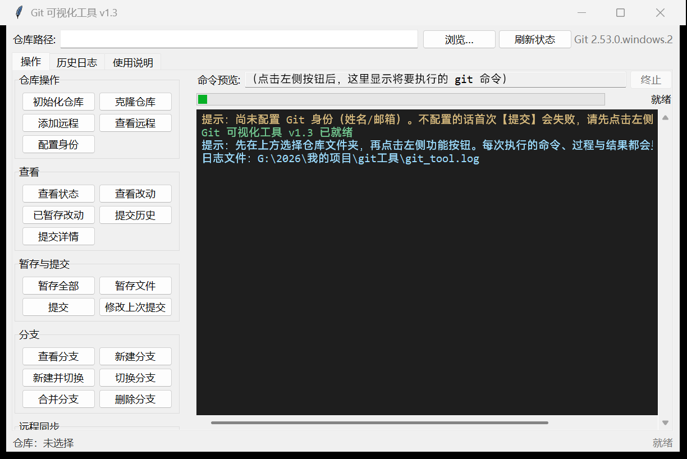
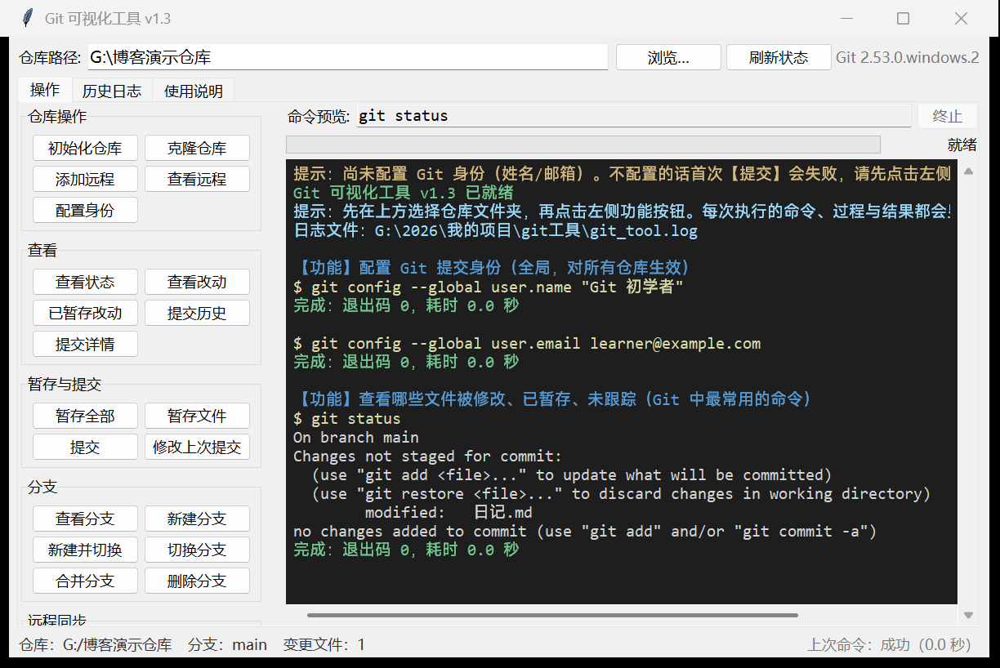
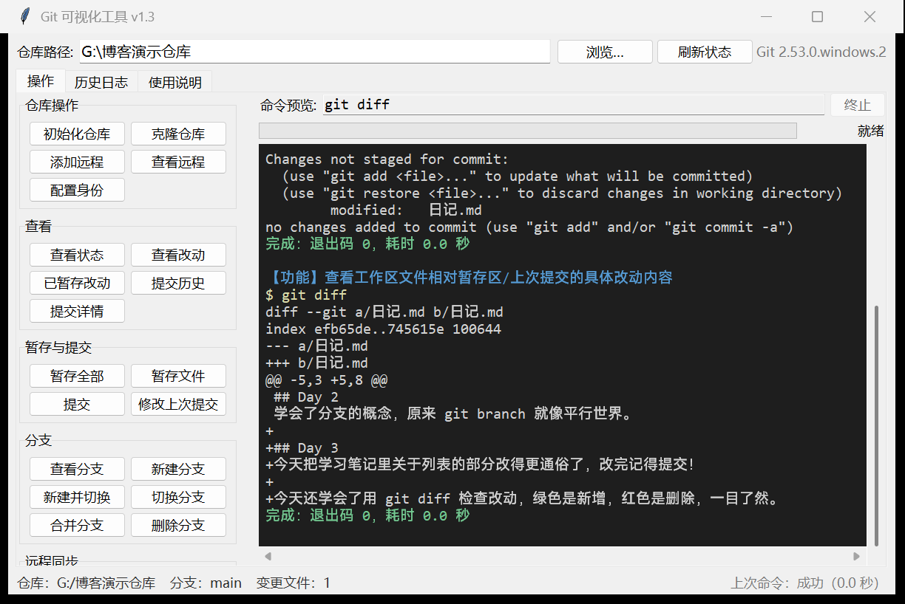
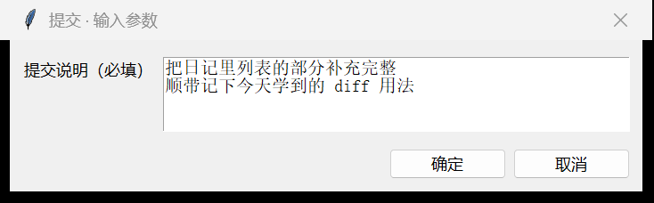
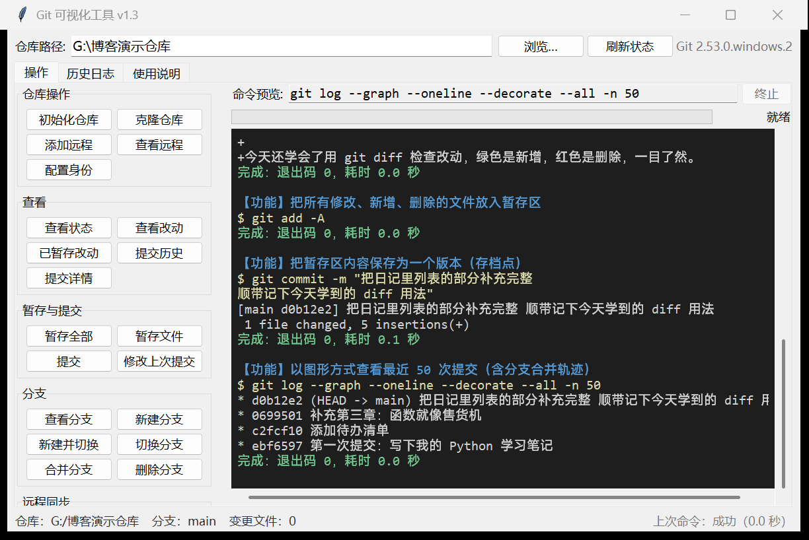
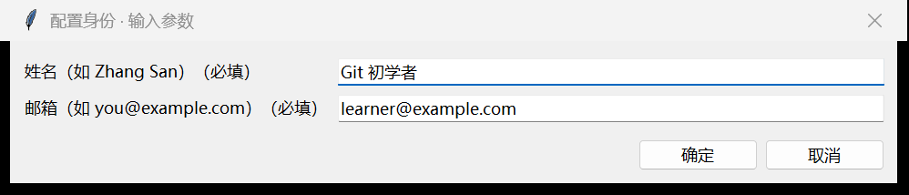
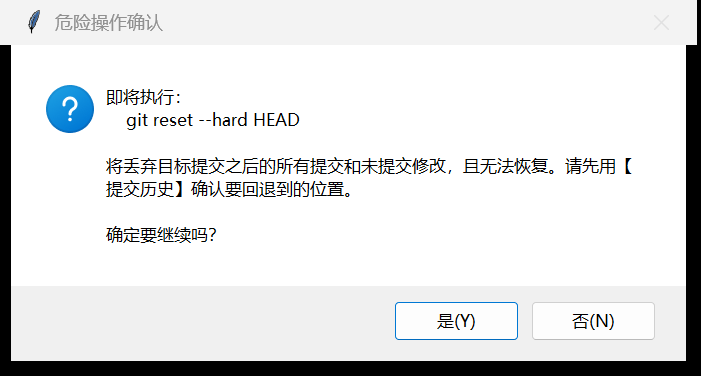
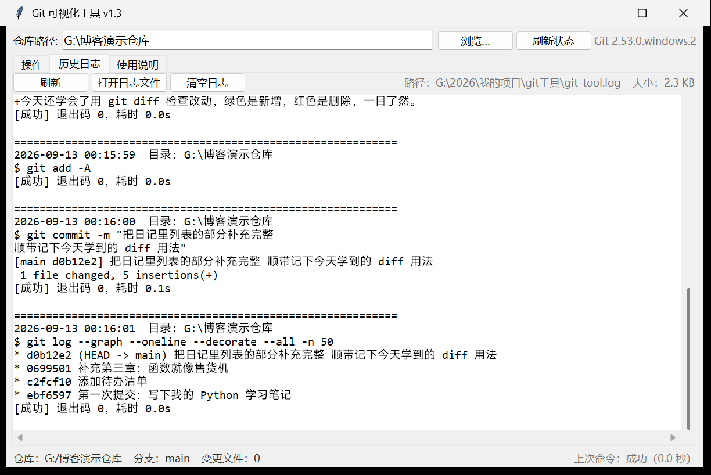
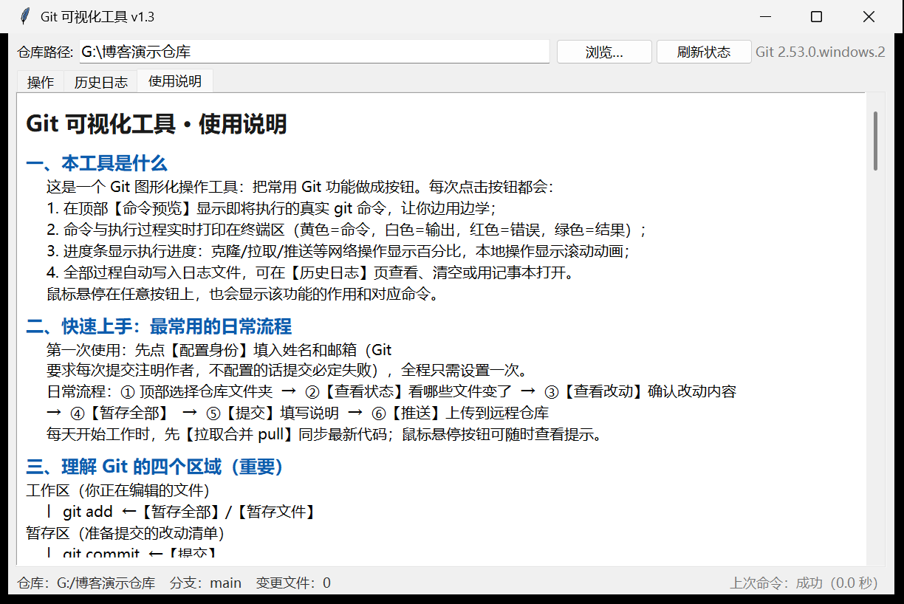

# 我连 Git 都不会，于是先给自己造了一个"看得见"的 Git

> 发布日期：2026-09-13
> 一篇迟到的忏悔，和一个 1357 行的小工具的出生记录。

## 一、Git 是一座山，说明书还是英文的

先坦白：我是一个"知道 Git 很重要，但一直不会用"的人。

每次打开教程，看到的都是这样的画面——黑色窗口里一行 `$` 符号冷冷地亮着，
仿佛在说：**报错全英文，输了别后悔，后悔没处跑。**

`git reset --hard`？听起来就像"格式化硬盘"。`detached HEAD`？我的头还好好的挂在脖子上。
于是我一边羡慕同事们优雅地 commit、push，一边把自己的项目 folder 活成了
`最终版`、`最终版2`、`最终版真的不改了`。

九月初，我受够了。我坐下来，给自己写了一张需求单：

> 我知道 git 是开发时经常需要的一个版本控制工具，但是我不会使用。
> 帮我开发一个 win 端的可视化工具，把 git 的各个功能封装为功能按钮，
> 但需要展示出在点击时执行了什么命令，并给出执行过程和结果。
> 保留日志。执行过程最好也加入进度条。可以在界面中使用终端这样的界面展示内容。
> 这个工具中还要附注使用说明，说明各个功能是做什么用的，应该什么时候进行使用。

注意里面藏着一个小心思：**我不只是想要按钮，我还想看着命令学。**
按钮是拐杖，命令才是腿。所以"命令预览 + 终端回显"不是技术选型，是我的私心。

## 二、它长这样

几个小时后，第一版跑起来了。一个 1186 行的 Python 文件，用 tkinter 写的，
不依赖任何第三方库。37 个功能按钮，按"仓库操作 / 查看 / 暂存与提交 / 分支 /
远程同步 / 撤销与回退 / 储藏与标签"分成七组。



最上面一行是命令预览——点任何按钮，它先把**将要执行的真实命令**亮给你看；
下面的深色终端区实时回显执行过程：黄色是命令、白色是输出、红色是错误、
绿色是结果。第一次看到自己点个按钮，`$ git status` 就在下面老老实实跑起来的时候，
我居然有点感动：原来命令行这么 obedient（听话），只是以前没人给我翻译。

日常流程就是四步：看状态 → 看改动 → 暂存 → 提交。





提交的时候会弹一个对话框，说明可以写多行——



提交完点一下【提交历史】，图形化的 log 直接把存档轨迹画出来：



到这里，"会用 Git"这件事，从一座山变成了四级台阶。

## 三、折腾一：提交按钮按下去，天塌了

工具做好当晚，我兴冲冲地拿真实项目试：查看状态 ✓、暂存 ✓、提交——

```
失败：退出码 128
Author identity unknown
*** Please tell me who you are.
```

英文我认识，连起来我不懂。什么叫"身份未知"？我是谁我不知道吗？

排查后才知道：**Git 规定每次提交都必须记录"作者是谁"（姓名 + 邮箱），
而这玩意儿装完 Git 是没有的，需要自己配置一次。不配置，所有提交必定失败。**
对老手这是常识，对新手这是一堵墙上又糊的一层墙——报错还全是英文。

修复思路特别朴素：**报错必须翻译成人话，缺什么就引导补什么。**

- 加了一个【配置身份】按钮，填一次姓名邮箱，自动跑配置命令；



- 加了"失败自动诊断"：任何命令失败后，分析错误输出，用中文告诉你原因和下一步。
  现在覆盖了六种新手最容易撞上的情况：没配身份、不是仓库、合并冲突、
  推送被拒、登录问题、没有可提交的内容；
- 打开工具时就预检：没配身份，终端里提前提醒"首次提交会失败"。

那天我在折腾记录里写下一句话，后来成了这个项目的第一条原则：

> **给新手用的工具，不能假设任何前置知识。**

## 四、折腾二：双击闪退，连遗言都没有

第二天，我把工具发给"另一个我"（也就是同样不懂 Git 的自己）用——双击
`启动Git工具.bat`，黑窗口一闪而过，什么都没了。

没有报错，没有弹窗，像什么都没发生过。这种 bug 最让人抓狂：你连它死前说
什么都不知道。

后来我把 bat 的输出重定向到文件才抓到遗言：**"命令语法不正确。"**
再一查文件字节，真相哭笑不得——这个 bat 是用 **Unix 换行符（LF）**保存的，
而 Windows 的 cmd 解析批处理**必须用 CRLF 换行**。就为了这个，括号块整个
解析错乱，脚本当场去世。

顺手还挖出两个暗雷：bat 里写在括号块中的 `%errorlevel%` 拿到的是命令执行
**之前**的旧值（所以就算程序崩了，"按任意键继续"也永远轮不到执行）；
`where python` 找到的第一个结果可能是微软商店的**假 python**，运行只会
给你弹个应用商店。

修复之后的 bat 长这样：不用括号块、动态判断退出码、先验证 python 真能跑，
并且存成 UTF-8 + CRLF。同时我在 Python 程序里也加了兜底——启动阶段无论出
什么异常，都把完整错误写进日志并弹窗，**再也不会一闪而过**：

```bat
python --version >nul 2>nul   :: 先验证 python 真的能跑，防商店假 python
if errorlevel 1 goto try_py

python git_visual_tool.py
if errorlevel 1 pause         :: 真崩了会停在窗口让你看清报错
goto end
```

> **教训：Windows 批处理是老古董，对格式斤斤计较。**
> 换行符必须是 CRLF，变量展开时机有坑，错误处理别放括号块里。
> 能自动化的验证就不要靠肉眼看。

## 五、折腾三：全面审计——这次我先忍住不动手

前两轮都是"哪里炸修哪里"。第三轮我换了个玩法：**先通读全部代码列疑点，
再逐个用实验取证，按收益/风险排序，证据不支持的一个都不修。**

取证过程本身特别好玩（全部离线、用临时目录和隔离配置）：

| 实验 | 结果 |
|------|------|
| 5000 个文件的仓库，刷新状态栏 | 3 次 git 调用总共 92ms → 性能没问题 |
| 20MB 日志整读 | 0.03 秒 → 不是问题 |
| 终端插入 2 万行 | 0.85 秒 → 不是问题 |
| 父进程退出后，运行中的子进程 | **完整跑完 15 秒 → 孤儿进程，实锤** |
| 关窗瞬间终止命令 | **杀空了 → 竞态，实锤** |

最后只修了五件事，而且每一件修完都立刻测试：

1. **关窗时弹确认**："还有命令在执行，退出会终止它，确定吗？"
   （测试时还顺带抓出一个竞态：命令刚启动的一瞬间点终止会杀空，
   改成了停止请求标志位，启动完成后补杀。）
2. **失败提示补齐三类**：没配远程就 push、分支没关联上游、远程地址写错——
   这恰好是新手 init 完仓库后必然撞上的第二堵墙；
3. **粘贴带引号的路径不再被拒**（Windows"复制文件地址"给的是带引号的）；
4. **带令牌的 URL 在显示层打码**：`https://***@...`，日志里也不再明文；
5. **自定义命令引号不配对**时，友好提示并按空格拆分，而不是甩英文报错。

同样重要的是**不修清单**：状态栏刷新、日志读取、终端行数——实测都快得很，
一行没动。审计结束那天我最深的感受不是"修了多少"，而是一种少有的平静：

> **克制也是开发的一部分。证据不支持的时候，忍住不重构，比改代码难多了。**

顺带一提，审计期间还发生过一件哭笑不得的事：一次自动化测试忘了屏蔽弹窗，
工具的"配置身份"引导窗口真的弹了出来——被坐在电脑前的我顺手点完，
配置命令成功执行。相当于意外做了一次真人端到端测试。**你的用户会点到你
想不到的地方，哪怕这个用户就是你自己。**

另外，安全设计上我坚持了一点：所有危险操作（回退丢弃、强制推送、撤销修改、
清理未跟踪）都必须过一道原生确认框，把"即将执行的命令 + 后果"写清楚——



所有执行过的命令和结果自动写入日志，出了问题随时翻旧账：



工具里还内置了一份完整的使用说明——每个按钮是干嘛的、什么时候该用、
危险操作有哪些、常见问题怎么解。毕竟需求单里写了：**"说明各个功能是做什么
用的，应该什么时候进行使用"**——这一条是写给我自己看的。



## 六、开发记录：八天，四个版本

| 版本 | 日期 | 干了什么 |
|------|------|----------|
| v1.0 | 09-05 | 1186 行初版：37 个功能按钮、命令预览、终端回显、进度条、日志、内置说明 |
| v1.1 | 09-05 | 【配置身份】按钮、6 类失败中文诊断、启动预检、状态栏乱码修复 |
| v1.2 | 09-05 | 重写启动 bat（CRLF / 防假 python / 失败不关窗）、崩溃兜底弹窗 |
| v1.3 | 09-12 | 全面审计：孤儿进程 + 竞态修复、失败提示补齐、路径规整、凭据打码、14 项回归全过 |

代码从 1186 行长到 1357 行，但目录始终只有三份文件：程序、启动器、折腾记录。
没有依赖，没有配置文件，没有数据库——**Python 自带的 tkinter + 你电脑里的 git，
就是全部。**

## 七、我学到的事

**1. 报错要说人话。**
`Author identity unknown` 和"还没配置身份，点这个按钮填一下"之间，
隔着一整个新手与老手的距离。工具的职责不是复述错误，是翻译错误。

**2. 证据先于直觉。**
我本来信心满满地以为"状态栏刷新卡顿"是个大问题，实验做完发现 5000 个文件
也才 92ms；而"关窗孤儿进程"这种我从没想过的点，反而是最实锤的坑。
直觉负责列清单，实验负责划掉清单。

**3. 给未来的自己留路。**
日志、折腾记录、使用说明，本质上是同一件事：现在的我把踩过的坑写下来，
让三个月后忘光了的自己能看懂。写博客也是——比如这篇。

最后坦白：这个工具是我和 AI 结对写出来的。我出需求、当第一个用户、
在每一轮折腾里做取舍；AI 出手速和不怕麻烦。但"为什么不修"的那些决定、
每一句报错的人话翻译、还有这篇博客里所有的沮丧和得意——都是我的。

工具现在就三份文件，放到任何一台装了 Python 和 Git 的 Windows 电脑上，
双击就能用。第一个按钮，永远是【配置身份】。

如果你也是个"知道 Git 重要但一直没学"的人，希望它能替你对命令行说一句：
**别怕，我给你翻译。**
